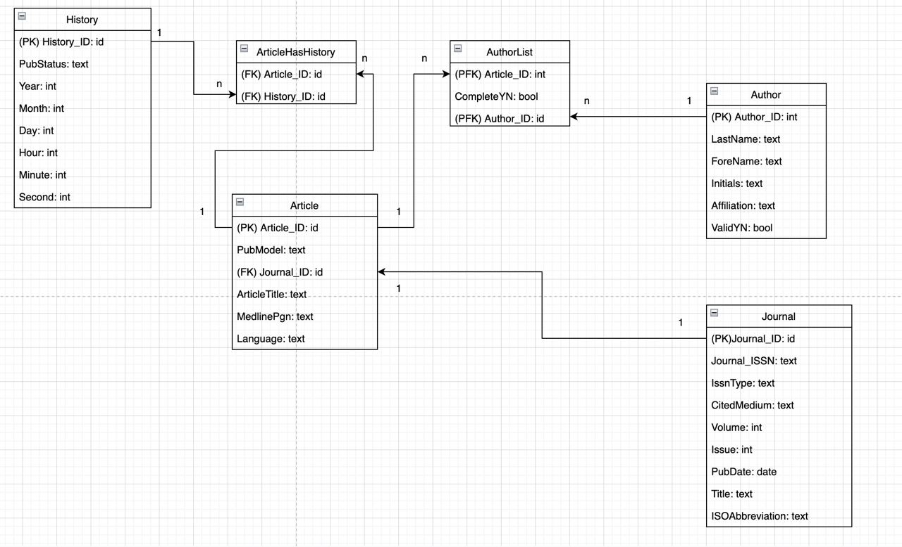
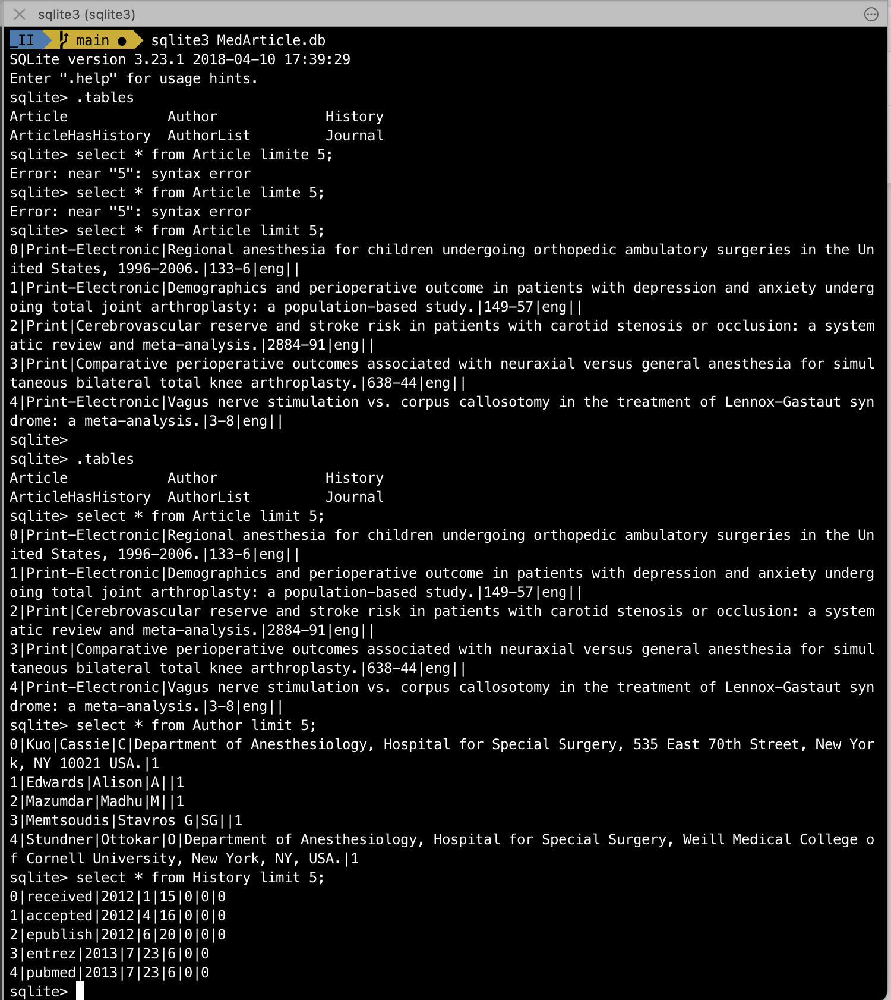
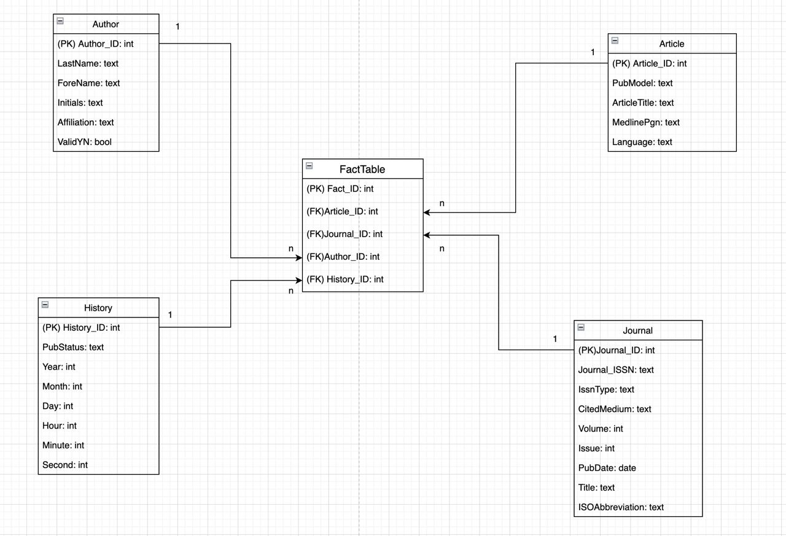
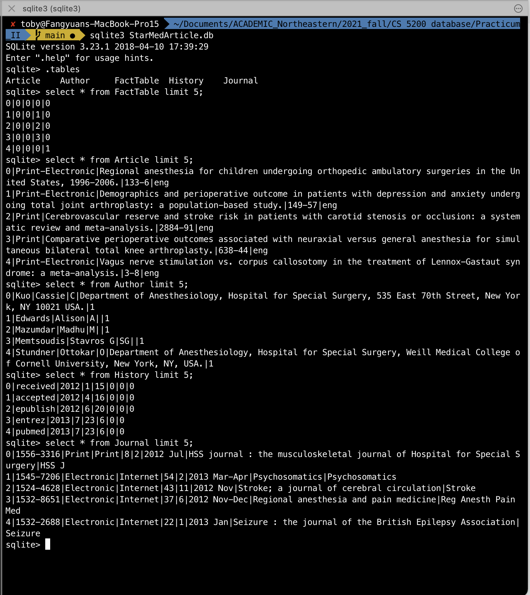
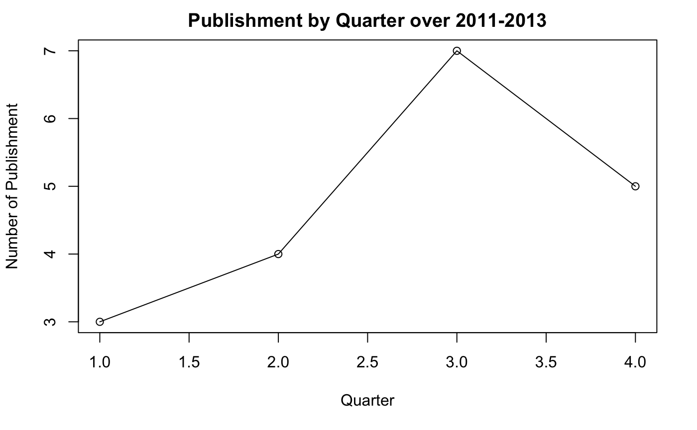

# CS5200 Database Management Practicum2 Fall 2021

This repo hosts the work for this practicum 2 of the class CS 5200.

## How to use, view and reproduce.

The main goal of this project is to extract wanted information from an XML file that describes published medical data (named as `pubmed_sample.xml`).

In part 1, I created a normalized relational OLTP database and populate it with data from an XML document. I extract the useful info from XML using python and bs4 (code can be found in the jupyter notebook `XML_explore.ipynb`). The database creation and population is conducted (by requirement) in R notebook (find in `practicumII_Part1.rmd`).

In Part 2 I turned the normalized schema into a denormalized schema suitable for OLAP by using star-method/schema.

In Part 3 I used use the OLAP star schema from part 2 to do some (simple) data mining.

The process of part 2 and 3 can be found in the R notebook `practicumII_Part2_3.rmd`).

Step 0:

To reproduce the result, make sure you have `sqlite3` installed on your machine, the jupyter notebook was run under python 3.6, and lastly you will need an R studio to open the `.rmd` files.

Step 1:

Run the jupyter notebook from scratch (you can open it and click "restart and run all cell", the double triangle button) to generate all the .csv files that we will use later.

Step 2:

Open part1 r notebook, click "run" -> "restart and run all chunks". You will have the sqlite3 database populated as via the schema described in "ERD_v3.jpg":

And you can check them by opening the database in terminal via `sqlite3 MedArticle.db` as shown below:

Step 3:

Open part 2_3 r notebook, click "run" -> "restart and run all chunks". You will have the sqlite3 database populated as via the schema described in "StarERD_v1.jpg":

And you can check them by opening the database in terminal via `sqlite3 StarMedArticle.db` as shown below:

And finally, at the bottom of the notebook, you will find the line graph of the publish by quarter result as shown in this graph:

You can see that Autumn (Q3) seems to be the most popular publication time.
